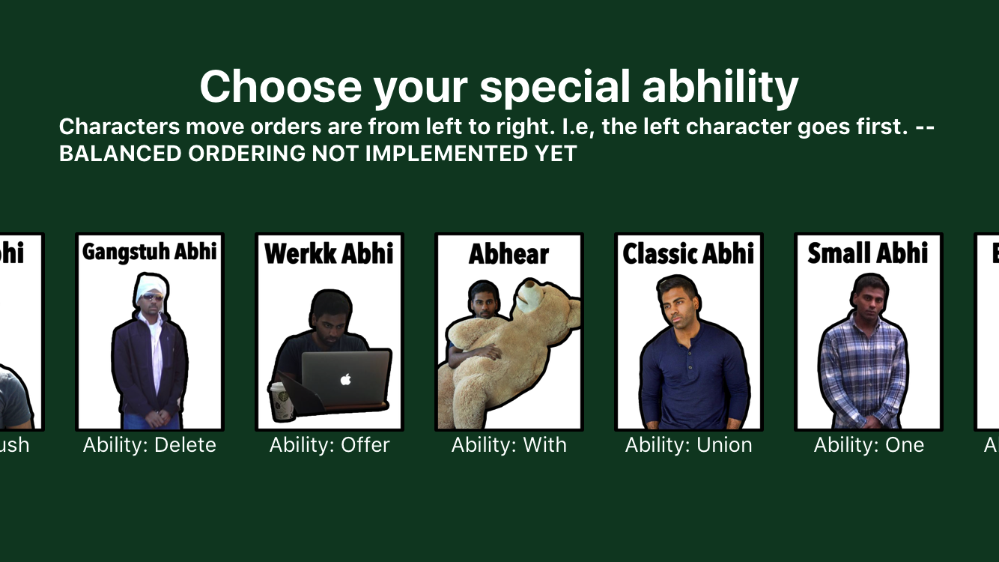
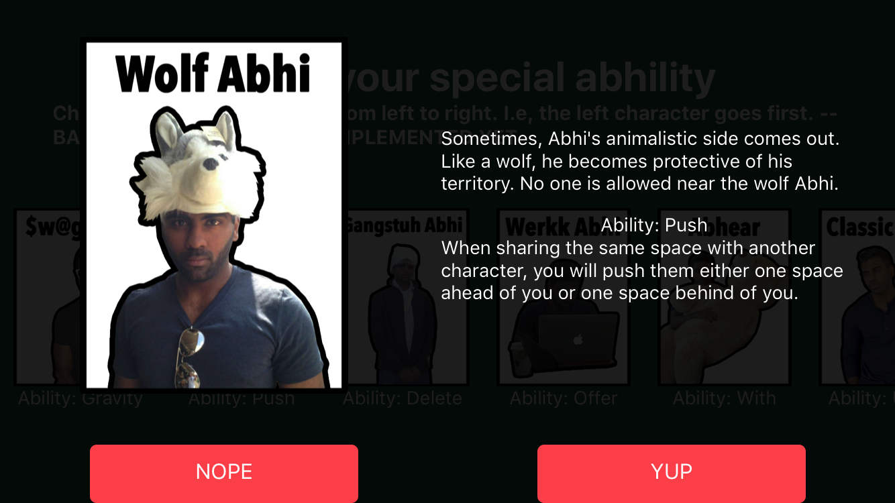
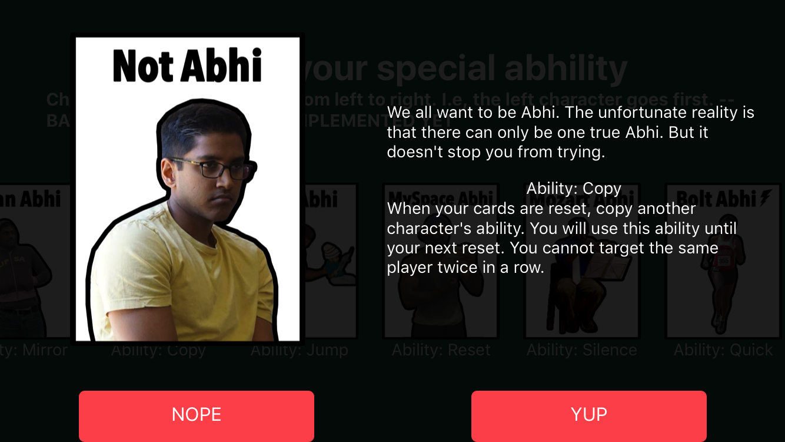
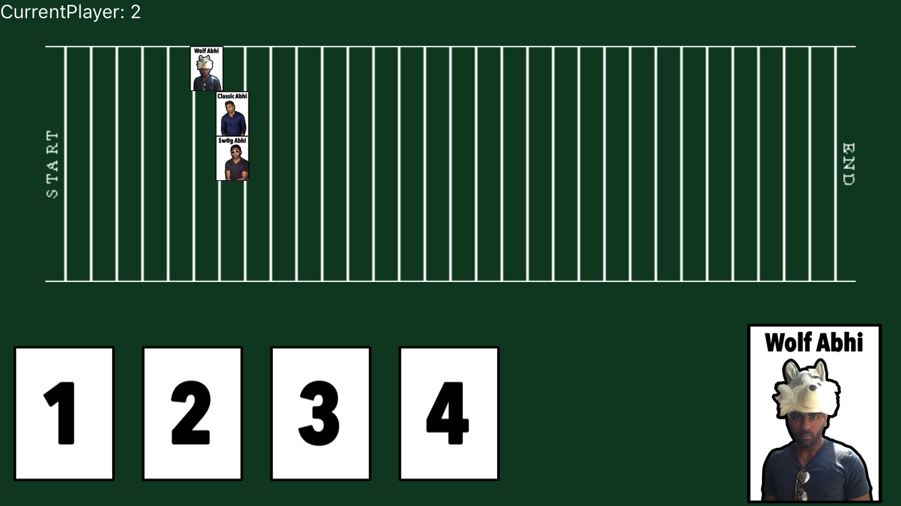
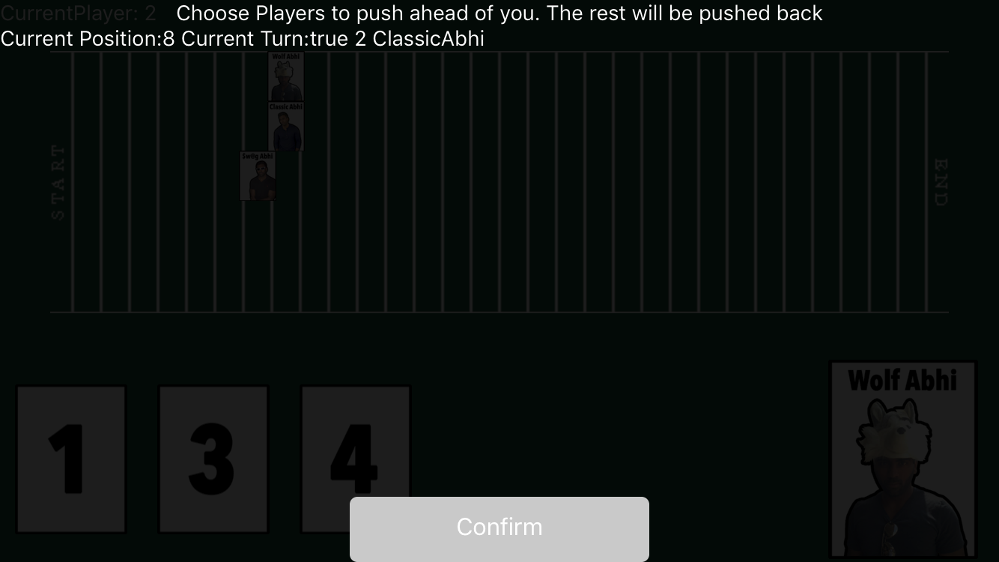
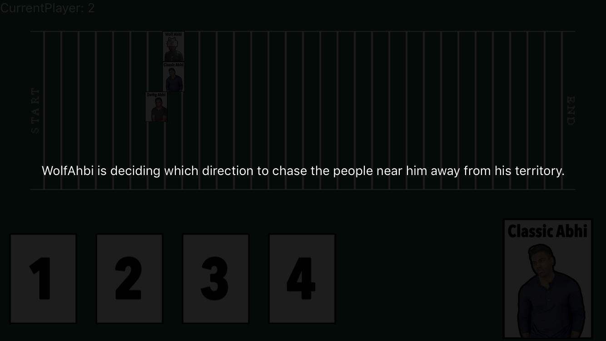
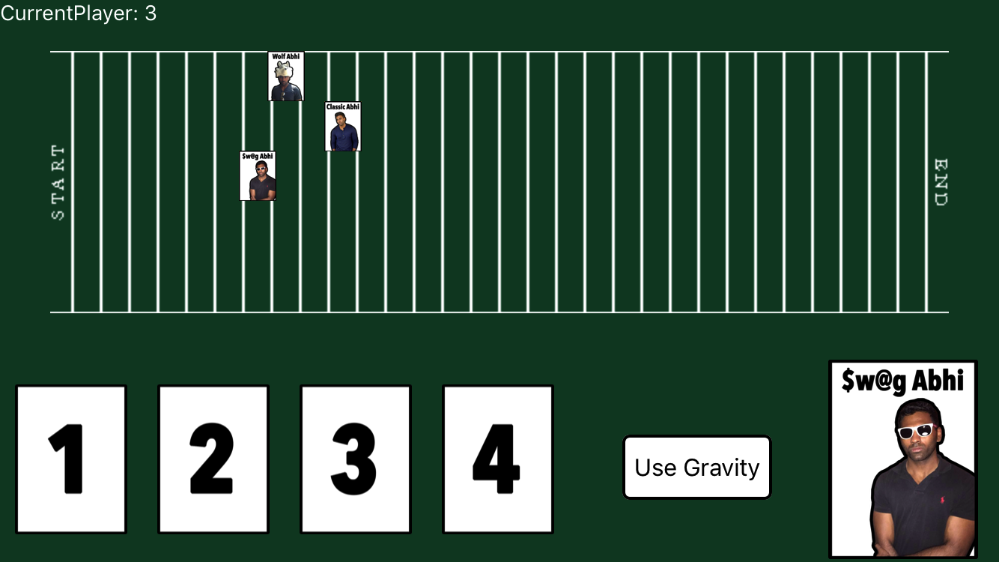
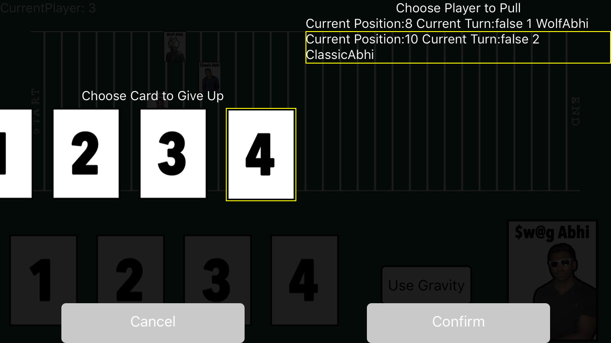

# middleRaceFrontEnd
Turn based multiplayer racing game where the goal is to finish in the middle.

### Starting MiddleRace
Run react-native run-ios in Node.js to start the simulator. Make sure you have xcode installed.

# Choosing a character
Before you begin a game of Middle-Race, all the players in the game must select a character. There are 13 characters to choose from, each with a unique ability. Every person must choose a different character.

You can scroll left and right to view which characters are available.

Tap on a character to view more details. I've highlighted two of my favorite characters below:

When all the players have picked a character, you are ready to begin the game!

# Gameplay
Middle-Race is a turn based multiplayer game where the goal is to finish as close to the middle as possible. Players are given move cards that move them forward the track, as well as special abilities that can either passively or actively affect the board state.

*An example of a game in progress.*

Special abilities are either activated on your turn or automatically activates when certain conditions are met. For example, the character WolfAbhi has the ability to push players sharing the same space as him either one space forward or backwards, as shown below.

When players with passive abilities like Wolf Abhi's are making their decision, the other players must wait for the choice to be made. This is the screen other players see while Wolf Abhi makes his choice:

Characters with active abilities can activate their abilities on their turn, often at the cost of a move card. For example, Swag Abhi has the ability to pull any character either one space ahead of below him by giving up a card, as shown below:

# Victory conditions

The goal is to finish the race as close to the middle as possible. For example, if there are 10 players in a game, the players who come 5th and 6th will be considered the victors, while the players coming first and last will be considered dead last.

While each special ability to weak on it's own, powerful effects can occur when they are combined. Thus, it is in your best interest to form alliances with other players in the game. However, to secure the winning position, you must be ready to betray your friends!

Since this game works best as a team game, players consider having forced teams, or assigning points to each ending position and summing up their team's points at the end of the game to decide the winner.

# Inspiration

This game is based off a game from a Korean gameshow called The Genius.
http://the-genius.wikia.com/wiki/Middle_Race

[Watch Season 3 Episode 3 for the first rendition of Middle Race.](https://www.reddit.com/r/koreanvariety/comments/2joq50/the_genius_s3e03_middle_race/)

[Watch Season 3 Episode 9 for the second rendition of Middle Race.](https://www.reddit.com/r/koreanvariety/comments/2nrxfl/the_genius_s3e09_middle_race/)

The characters are based off the coFounders of Horizons School of Technology.
